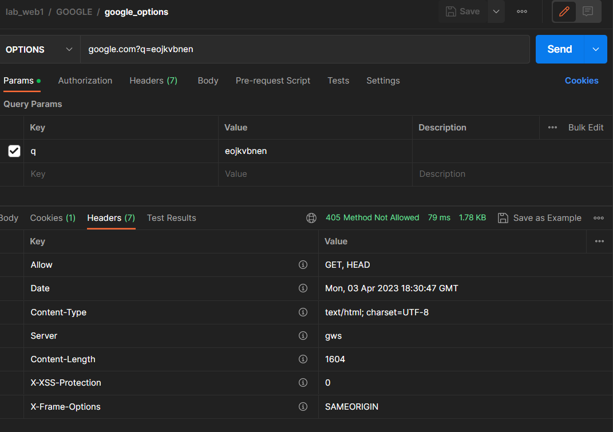
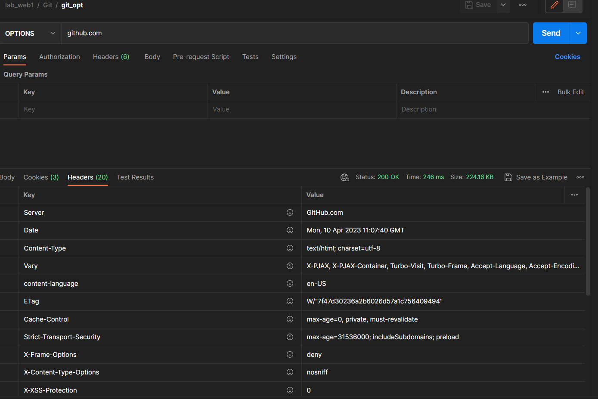
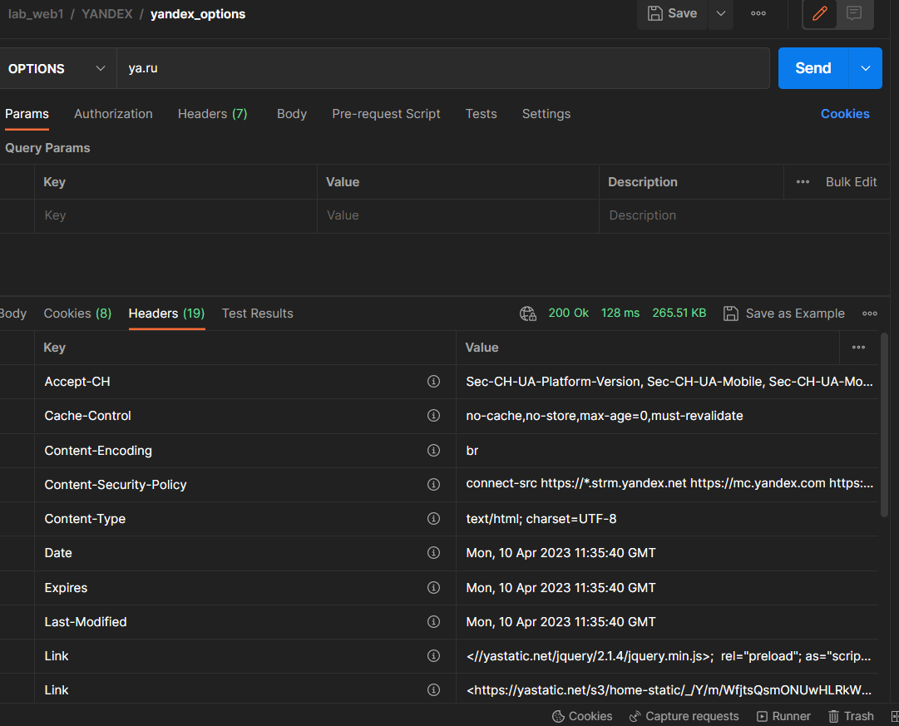
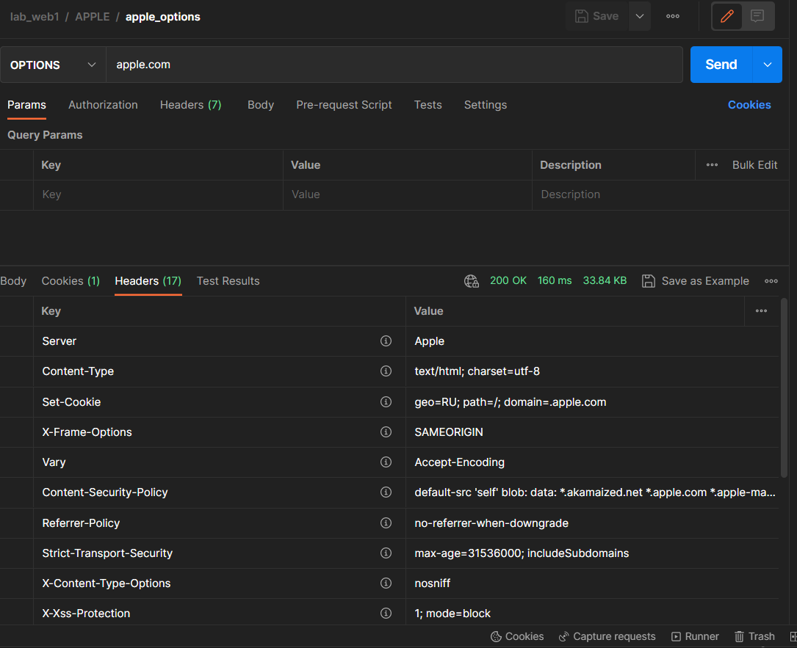

# ЛАБОРАТОРНАЯ РАБОТА №1
## Запрос OPTIONS

Метод Options возвращает в заголовке Allow список допустимых методов, а так же показывает параметры ресурса или сервера.

Запрос на https://www.google.com показывает, что есть два доступных метода GET и HEAD, а так же вернул код 405, значит сервер смог распознать запрос, но не дает права его реализовать.

 

Запросы на https://github.com, https://ya.ru, https://apple.com вернули код 200, что говорит об успешном выполнении, но заголовка Allow нет, значит допустимые методы отсутствуют.

 

 

 

