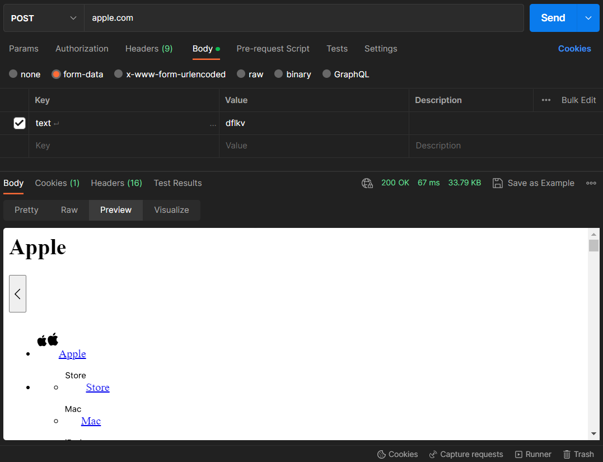
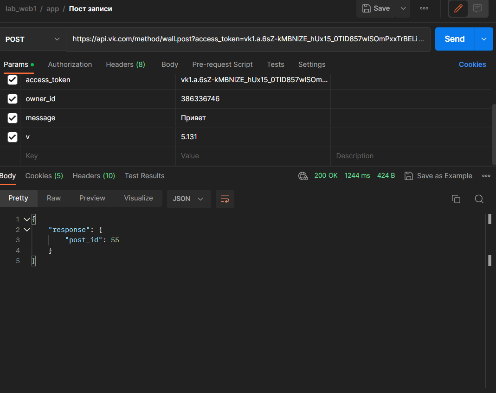

# ЛАБОРАТОРНАЯ РАБОТА №1
## Запрос OPTIONS
Метод Options возвращает в заголовке Allow список допустимых методов, а так же показывает параметры ресурса или сервера.


Запрос на https://www.google.com показывает, что есть два доступных метода GET и HEAD, а так же вернул код 405, значит сервер смог распознать запрос, но не дает права его реализовать.

 

Запросы на https://github.com, https://ya.ru, https://apple.com вернули код 200, что говорит об успешном выполнении, но заголовка Allow нет, значит допустимые методы отсутствуют.

 

 

 

## Запрос HEAD
Метод HEAD запрашивает заголовки такие же, которые возвращаются, если указанный ресурс будет запрошен с помощью GET, выполняется для экономии пропускной способности перед загрузкой большого ресурса.

Запрос на https://vk.com выдал код ошибки 418, но как и ожидалось, тело ответа пустое, хотя заголовки сущности, такие как Content-Length не должны быть пустыми.

 

 

Запросы на https://msn.com и https://apple.com выполнились с кодом 200, тело ответа пустое, заголовки сущности показываются.

 

 

 

 

## Запросы GET и POST
Метод GET запрашивает представление указанного ресурса, только получает данные, запрос не имеет тела, а при успешном ответе тело присылается.
Метод POST - отправляет данные на сервер. Тип тела запроса указывается в заголовке Content-Type, ответ так же имеет тело.

 Запросы GET и POST на https://ya.ru выполнились с кодом 200, тела ответов не пустые.

  

  

  

 Запросы на https://apple.com выполнились с кодом 200, тела ответов не пустые.

   

   

   

На https://google.com сработал только GET, POST завершился с кодом 405

   

   

   


# Получение id университета

```
{
    "response": {
        "count": 81,
        "items": [
            {
                "id": 248,
                "title": "МГТУ им. А. Н. Косыгина (бывш. МГТА им. А. Н. Косыгина, МТИ)"
            },
            {
                "id": 249,
                "title": "МГТУ ГА"
            },
            {
                "id": 250,
                "title": "МГТУ им. Н. Э. Баумана (бывш. МВТУ)"
            },
            
```

# Список факультетов

```

{
    "response": {
        "count": 22,
        "items": [
            {
                "id": 1032,
                "title": "Факультет инженерного бизнеса и менеджмента"
            },
            {
                "id": 1033,
                "title": "Факультет информатики и систем управления (Информатика, искусственный интеллект и системы управления)"
            },
            {
                "id": 1034,
                "title": "Факультет машиностроительных технологий"
            },
            {
                "id": 1035,
                "title": "Факультет оптико-электронного приборостроения"
            },
            {
                "id": 1036,
                "title": "Приборостроительный факультет"
            },
            {
                "id": 1037,
                "title": "Радиотехнический факультет"
            },
            {
                "id": 1038,
                "title": "Факультет радиоэлектроники и лазерной техники"
            },
            {
                "id": 1039,
                "title": "Факультет ракетно-космической техники"
            },
            {
                "id": 1040,
                "title": "Факультет робототехники и комплексной автоматизации"
            },
            {
                "id": 1041,
                "title": "Факультет специального машиностроения"
            },
            {
                "id": 1042,
                "title": "Факультет фундаментальных наук"
            },
            {
                "id": 1043,
                "title": "Факультет энергомашиностроения"
            },
            {
                "id": 1044,
                "title": "Кафедра юриспруденции, интеллектуальной собственности и судебной экспертизы"
            },
            {
                "id": 1803,
                "title": "Факультет биомедицинской техники"
            },
            {
                "id": 1804,
                "title": "Факультет социальных и гуманитарных наук"
            },
            {
                "id": 56430,
                "title": "Факультет лингвистики"
            },
            {
                "id": 56431,
                "title": "Физкультурно-оздоровительный факультет"
            },
            {
                "id": 2071503,
                "title": "Головной учебно-исследовательский и методический центр (ГУИМЦ)"
            },
            {
                "id": 2183736,
                "title": "Военный учебный центр"
            },
            {
                "id": 2280344,
                "title": "Кафедра «Цифровая криминалистика»"
            },
            {
                "id": 2281364,
                "title": "Факультет международных образовательных программ"
            },
            {
                "id": 2281365,
                "title": "Кафедра «Безопасность в цифровом мире»"
            }
        ]
    }
}

```

# Моя аватарка

```

{
    "response": [
        {
            "id": 386336746,
            "photo_max": "https://sun1-30.userapi.com/s/v1/ig2/wxYx6fDttGNi8c7LbSHgb-kkKCKhPR6WCQTkEZ_X-Iup-C6R7drd_ZsAH6f9876wnFSiuLEFXLsIkYTfJ7CeQoJR.jpg?size=400x400&quality=96&crop=417,280,981,981&ava=1",
            "first_name": "Артем",
            "last_name": "Артеменко",
            "can_access_closed": true,
            "is_closed": true
        }
    ]
}

```

Код ответа на запросы 200, тела ответов содержат количество айтемов, их идентификаторы, а также содержимое параметров.
Кодировка и формат - ```application/json; charset=utf-8```
Версия протокола HTTP - 5.131

# Отправление записи на стену пользователю
   

```
{
    "response": {
        "post_id": 55
    }
}
```

Размещение записи выполнено успешно, так как метод вернул объект с полями response и post_id
